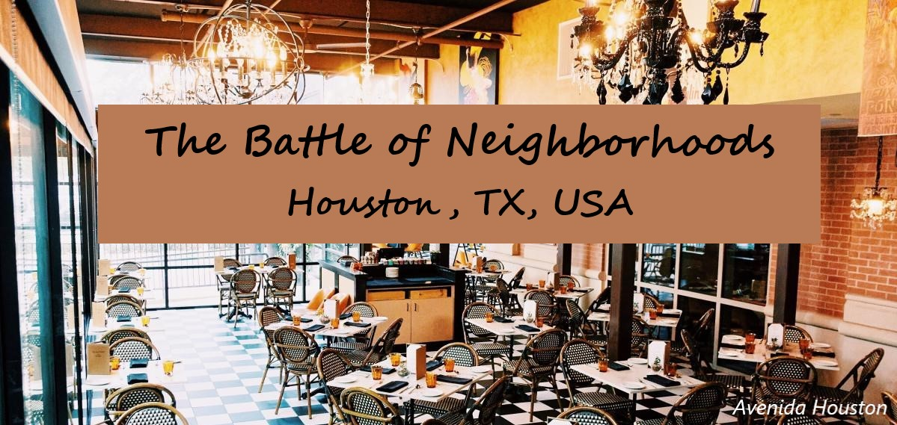

## 
 **THE BATTLE OF THE NEIGHBOURHOODS** 

### 
 --- HOUSTON, TX, USA --- 

## **⛳ Introduction**
### **Background**🌆
Houston is the fourth-most populous city in the United States. Houston is also one of the most multicultural cities in the world, making life in Houston a wonderful multicultural experience for all. 
### **Business Problem**❔
The objective of this project is to find the best neighborhood in Houston to open a restaurant using Foursquare location data. We will use the data science and machine learning tools we know to analyze the data and get a conclusion for the stakeholder to make a decision.
### **Target Audience**👪
* Small business owners who want to open their own restaurants.

## 📁 **Data**
The data we need:
1. ***A list of Houston neighborhood data***
* **Data Source:** https://en.wikipedia.org/wiki/List_of_neighborhoods_in_Houston
* **Description:** This Wikipedia page contains a list of neighborhoods in Houston. We will scrape and clean the data, and read it into a pandas data frame.
2. ***Geographical coordinates of each neighborhood***
* **Data Source:** using geopy library (https://cocl.us/Geospatial_data)
* **Description:** The second data provides the geographical coordinates of each neighborhood in Houston.
3. ***Venue Data using Foursquare API***
* **Data Source:** https://foursquare.com/developers/apps
* **Description:** From Foursquare API we can get the name,category,latitude,longitude for each venue.

## 🔑**Prerequisites**
* sklearn
* matplotlib
* pandas
* numpy
* scipy
* geopy
* beautifulsoup4
* requests
* folium
* kmeans
* scikit-learn
## ⭐️**Keywords**
- Machine Learning
- Web Scraping
- Foursquare API
- Geocoder
- Beautiful Soup
- Folium

### ⌛Clustered Neighborhoods

### 📝**Blog Post (Medium)**
 I have posted the complete report as a blog on Medium. Here is the [link](https://shanwenqian23.medium.com).
 
## 😊 ️**Author**
* [Wenqian Shan](www.linkedin.com/in/shanwenqian23)
